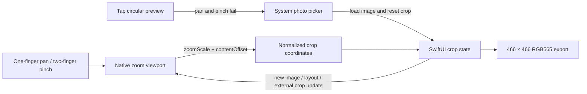

# 吧唧 / Badge Studio

SwiftUI + CoreBluetooth companion for Waveshare ESP32-S3-Touch-AMOLED-1.75C.
Requires this repository's companion firmware; upstream PineTime firmware uses
a different protocol. iOS 17 or later. No third-party iOS packages or cloud service.

## Included

- Discover, system-passkey pair, remember and reconnect to a badge in foreground.
- Automatically sync UTC and the phone's effective timezone after connection and
  on foreground return; show acknowledged sync result and live device clock.
- Actual battery/charging, display sleep/wake, persistent brightness and timeout.
- Persistent always-on clock setting on supported firmware; shows actual ambient,
  black-screen or awake state. The clock uses dim text on black and shifts position
  periodically; PWR or BOOT wakes the existing application.
- Five existing watch faces and three character badges, with device-rendered
  reference previews. These are style previews, not a live screen stream.
- System photo picker, one-finger pan / two-finger pinch circular preview and identical 466×466 crop.
  RGB565 is sent over encrypted BLE with a bounded window, cumulative offsets,
  transfer ID, CRC32 and final durable-save acknowledgement.
- Open existing device apps, view firmware version and forget the remembered device.

Timer management, OTA, arbitrary downloadable watch faces and background BLE
operation are not part of v1. The three tabs are Device, Styles and Settings.
The device has BLE, but no onboard NFC controller or antenna.

## Use

1. Flash the ESP32 port and open the iOS app. Allow Bluetooth when prompted.
2. Select `InfiniTime Badge`. Enter the six-digit code displayed on the badge
   into the iOS system pairing alert. Do not post screenshots of that code.
3. The app reads actual state, then automatically syncs time and timezone.
4. Tap a watch/character to apply it, or choose **制作照片吧唧** to pick, crop and send.
   Tap the circular preview to choose or replace a photo; drag and pinch to crop,
   then tap **发送到吧唧**. There is no separate photo-selection button.
   Keep the app in foreground. **已保存到吧唧** means the device has committed the file.

The 1.75C has no external RTC. The internal clock continues while disconnected
and retains its anchor across supported resets; total power loss requires a new
sync. Travel/DST changes apply on the next phone connection/foreground sync.

To fully unpair, forget the device in the app and in iOS Bluetooth settings,
then use **Settings → Pair iPhone → Forget phones** on the badge. This keeps photos
and other settings. A disconnected transfer is not automatically reported saved.

## Build and install

Open [BadgeStudio.xcodeproj](BadgeStudio.xcodeproj), select your own Apple team in
Signing & Capabilities and choose a connected iPhone. Build and Run in Xcode.
Developer Mode and trusting the Mac must be enabled on the phone. A free Personal
Team provisioning profile is time-limited; reinstall from Xcode when it expires.
No developer team or signing key is committed to this project.

The Xcode project is generated from `project.yml` using XcodeGen:

```sh
xcodegen generate --spec ios/project.yml
xcodebuild -project ios/BadgeStudio.xcodeproj -scheme BadgeStudio \
  -destination 'generic/platform=iOS' -derivedDataPath /tmp/badge-studio-derived \
  CODE_SIGNING_ALLOWED=NO build
```

Use a DerivedData directory outside cloud-synced Documents. File-provider extended
attributes on generated app bundles can make codesign reject resource metadata.
Unsigned compilation checks source correctness; it does not install an app.

## Architecture and validation

[Protocol, concurrency boundaries and Mermaid diagrams](../ports/esp32/docs/COMPANION.md).
CoreBluetooth callbacks are explicitly delivered on the main queue; the client's
state and UI share `MainActor`. Commands are serialized and acknowledged by the
firmware main loop. Device controls display reported values, not optimistic state.
GATT transport acknowledgement alone is never treated as a successful command.

The crop viewport uses a native `UIScrollView` for focal-point pinch zoom and pan,
with bounce disabled so the image always covers the crop. Its delegate converts
content offset and zoom into the same normalized crop used by the renderer.
SwiftUI updates configure the viewport only when the image, size or crop changes;
delegate publication is suppressed during that configuration.
The preview's one-finger tap opens the system photo picker only after native pan
and pinch recognizers fail. Selection and crop gestures are disabled while loading
or transferring a photo.



Run portable Swift checks on macOS from the repository root:

```sh
xcrun swiftc ios/BadgeStudio/Sources/Wire.swift ios/Tests/WireChecks.swift -o /tmp/badge-wire-checks
/tmp/badge-wire-checks
c++ -std=c++20 -I ports/esp32/tools/photo_stubs -I ports/esp32/include \
  ports/esp32/src/PhotoStore.cpp ports/esp32/tools/test_photo_store.cpp \
  -lz -o /tmp/badge-photo-test
/tmp/badge-photo-test
```

The C++ tests compile the actual shared photo receiver with an in-memory filesystem
and exercise ownership, ordering, CRC, timeout, cancellation, write/close/rename
failures, and successful atomic commit. Swift checks cover independent CRC vectors,
byte order, state validation, primary-color RGB565 encoding and crop geometry.
Neither suite establishes real iPhone pairing or BLE throughput. Those results
are recorded separately in [VALIDATION.md](../ports/esp32/VALIDATION.md).
