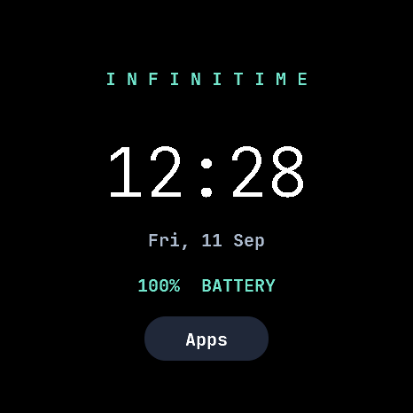
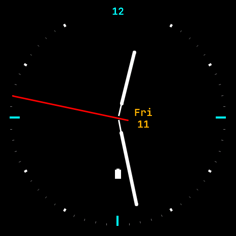
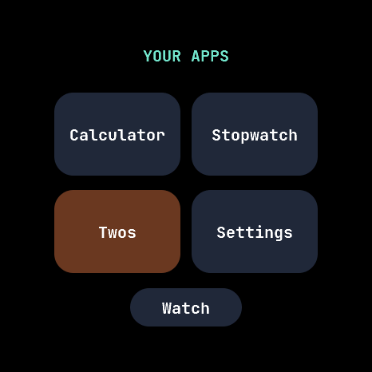
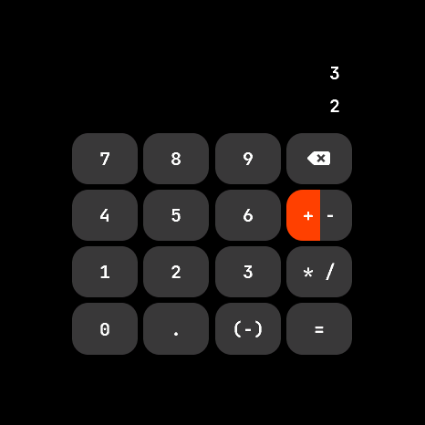
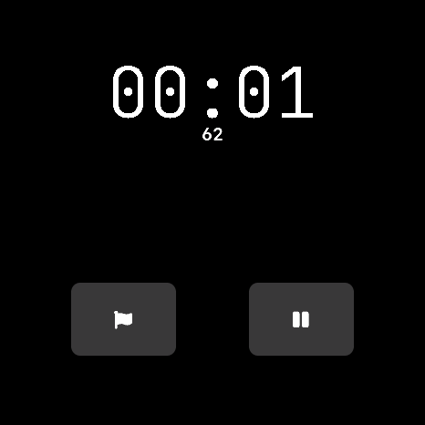
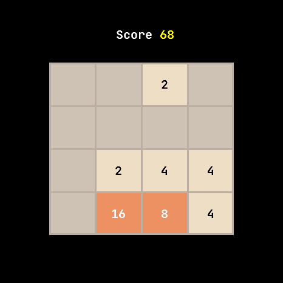
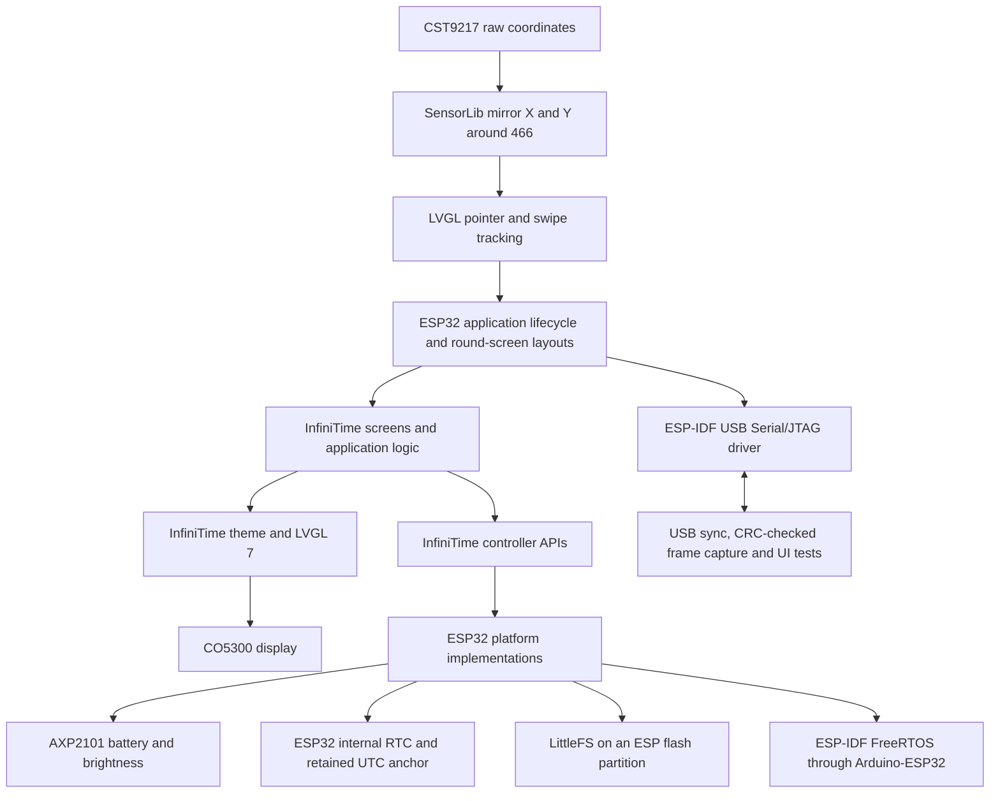

# InfiniTime on Waveshare ESP32-S3-Touch-AMOLED-1.75C

This GPL-3.0 port builds InfiniTime's LVGL 7 fork, theme, analog
watch face, calculator, stopwatch and Twos application for the Waveshare
466×466 round AMOLED board. It is a separate platform target, not a PineTime
binary and not the Waveshare demo with an InfiniTime logo.

## Device-rendered previews

| Digital | Analog | Launcher |
| --- | --- | --- |
|  |  |  |

| Calculator | Stopwatch | Twos |
| --- | --- | --- |
|  |  |  |

## Architecture



The include directory selects implementations of the Nordic-dependent battery,
brightness, flash and system-task interfaces. These adapters access real
hardware. There are no simulated sensor values. Platform-independent code is
compiled directly from `src/`, without copying it into the port. The pinned
Waveshare submodule supplies the manufacturer's tested driver libraries.

Native 466×466 rendering is used. Controls are placed within the circular
panel; a cropped/scaled 240×240 framebuffer is not used. Screen changes happen
outside LVGL callbacks so a callback cannot destroy its own objects.

```mermaid
sequenceDiagram
    participant Input as GPIO BOOT / AXP2101 PWR
    participant Loop as Application loop
    participant Panel as AMOLED brightness
    Input->>Loop: Button event (queued tests join here)
    Loop->>Panel: Restore configured brightness when asleep
    Loop->>Loop: lastActivity = millis()
    Loop->>Loop: Complete navigation and display updates
    Loop->>Loop: Read fresh millis(), then calculate elapsed inactivity
    Note over Loop: Never subtract a newer activity time from the earlier loop timestamp
```

## Hardware

| Function | Connection |
| --- | --- |
| AMOLED | CO5300, QSPI CS 12, clock 38, data 4/5/6/7, reset 1, X offset 6 |
| I²C | SDA 15, SCL 14 |
| Touch | CST9217 at 0x5A, reset 2, interrupt 11 |
| Power | AXP2101 at 0x34 |
| RTC | ESP32 internal RTC; no external PCF85063 |
| Memory | 32 MB flash (measured on this device), 8 MB octal PSRAM |
| USB | Native ESP32-S3 serial/JTAG |

This target is for **1.75C**, not **1.75 / 1.75-B**. Unsupported PineTime
hardware and protocols (heart-rate sensor, vibration motor, Nordic DFU,
Gadgetbridge services) are not advertised as working. The speaker, microphone,
IMU and TF slot are not required by the included applications.

## Build

1. Clone with `git clone --recurse-submodules --branch esp32-s3-waveshare-175 https://github.com/Micro66/InfiniTime.git`.
2. Install PlatformIO and Node.js.
3. In this directory run `npm ci --prefix tools`.
4. Run `pio run`. The pre-build script generates the upstream fonts and app IDs.

Build artifacts are in `.pio/build/waveshare-175/`. Before flashing, read and
verify a full flash backup with esptool. Use the **ESP32-S3** bootloader,
partition table and application generated by this target, never a PineTime
release image. See `tools/device.py` for backup, flash and verification commands.

## Controls

- Swipe left/right on a watch face to change face.
- Swipe up on a watch face to open the launcher.
- Tap launcher entries to open an application.
- BOOT button: return from an application to the launcher; from launcher to clock.
- When the display is off, BOOT wakes it without changing the page.
- PWR short press: display off/on; long press retains hardware power-off.
- Settings: brightness, screen timeout and local clock adjustment (±1 minute).
- The clock uses 24-hour time in UTC+8. Sync the full date from USB with `sync-time`.
- A running stopwatch consumes the first BOOT press to pause; press again to leave.

## Validation

Build and device results are recorded in `VALIDATION.md`. Successful compilation
alone does not establish that touch orientation, power behavior or rendering
works on hardware.

The current power mode turns AMOLED brightness to zero; it is **not deep sleep**.
USB, the CPU and stopwatch remain active. Wake with PWR or BOOT.
BLE/Gadgetbridge, Wi-Fi sync, activity tracking, audio and OTA are not implemented.

## USB tools

Install `python -m pip install esptool==4.8.1 pyserial pillow` first. From this directory:

```sh
python tools/device.py --port /dev/cu.usbmodem101 inspect
python tools/device.py --port /dev/cu.usbmodem101 backup /private/path/original.bin
python tools/device.py --port /dev/cu.usbmodem101 flash
python tools/device.py --port /dev/cu.usbmodem101 sync-time
python tools/device.py --port /dev/cu.usbmodem101 send status
python tools/device.py --port /dev/cu.usbmodem101 capture /path/to/frame.png
# Restore the complete original image, checking its SHA-256 manifest first:
python tools/device.py --port /dev/cu.usbmodem101 restore /private/path/original.bin
```

Backup tools target this device's measured **32 MiB** capacity. Run `inspect`
first on any other unit. The flash command writes only bootloader at 0x0,
partition table at 0x8000 and the application at 0x10000. First boot may format
its dedicated filesystem partition. Original firmware must be backed up first.

Serial diagnostics: `page N` (0 digital, 1 analog, 2 launcher, 3 calculator,
4 stopwatch, 5 Twos, 6 settings), `wake`, `sleep`, `status`, `capture`, and
`time YYYY-MM-DD HH:MM:SS`. `test-tap X Y` and `test-swipe left|right|up|down`
inject UI input for repeatable software tests; they do **not** test physical
CST9217 touch sensing. `status` reports the separate physical touch IRQ count.
`test-button boot|pwr` queues an event for the next matching button polling pass,
before automatic timeout evaluation. It shares the real button handler but does
not test GPIO electrical input or AXP2101 IRQ generation. `status` also reports
the configured timeout in milliseconds. Run `python tools/validate_buttons.py
--port /dev/cu.usbmodem101 --output /path/to/results` to check repeated power
toggles, BOOT wake/navigation, and automatic timeout with no serial wake helper.

The tested device reports 32 MiB flash and I2C addresses 0x18, 0x34, 0x40,
0x5A and 0x6B, matching the C board. Its display reset is GPIO1 and touch
reset GPIO2. These differ from the non-C board's GPIO39 and GPIO40.
The internal RTC keeps an integrity-checked UTC anchor across supported resets.
Full power loss invalidates it and requires USB time synchronization. This does
not provide the accuracy or independent battery backup of an external RTC.

Framebuffer capture uses 1 KiB chunks with CRC32 and acknowledgments. Duplicate
chunks are accepted after a lost acknowledgment. The ESP-IDF USB Serial/JTAG
driver owns the USB peripheral; Arduino HWCDC auto-initialization is disabled.

Run transport failure-path tests with
`python -m unittest discover -s tools -p 'test_*.py' -v`.
Run the on-device UI regression with
`python tools/validate.py --port /dev/cu.usbmodem101 --output /path/to/results`.
It drives applications and leaves the device on the digital clock.

The 1.75C touch panel is mounted opposite the display's rotation-0 coordinates.
As in the manufacturer's `05_LVGL_Widgets/13_LVGL_Widgets.ino`, SensorLib is
configured with `setMaxCoordinates(466, 466)` and `setMirrorXY(true, true)`.
Both pointer coordinates and swipe tracking consume the transformed coordinates.
`test-raw-tap X Y` uses the same SensorLib transform before injecting LVGL input;
`test-tap X Y` already takes display coordinates and does not test that transform.
