# InfiniTime on Waveshare ESP32-S3-Touch-AMOLED-1.75C

This GPL-3.0 port builds InfiniTime's LVGL 7 fork, theme, analog
watch face, calculator, stopwatch and Twos application for the Waveshare
466×466 round AMOLED board. It is a separate platform target, not a PineTime
binary and not the Waveshare demo with an InfiniTime logo.

## Device-rendered previews

| Digital | Analog | Launcher |
| --- | --- | --- |
|  |  |  |

| Calculator | Stopwatch | Twos |
| --- | --- | --- |
|  |  |  |

## Architecture

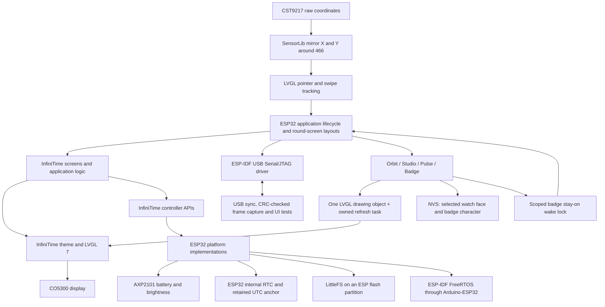

The include directory selects implementations of the Nordic-dependent battery,
brightness, flash and system-task interfaces. These adapters access real
hardware. There are no simulated sensor values. Platform-independent code is
compiled directly from `src/`, without copying it into the port. The pinned
Waveshare submodule supplies the manufacturer's tested driver libraries.

Native 466×466 rendering is used. Controls are placed within the circular
panel; a cropped/scaled 240×240 framebuffer is not used. Screen changes happen
outside LVGL callbacks so a callback cannot destroy its own objects.

```mermaid
sequenceDiagram
    participant Input as GPIO BOOT / AXP2101 PWR
    participant Loop as Application loop
    participant Panel as AMOLED brightness
    Input->>Loop: Button event (queued tests join here)
    Loop->>Panel: Restore configured brightness when asleep
    Loop->>Loop: lastActivity = millis()
    Loop->>Loop: Complete navigation and display updates
    Loop->>Loop: Read fresh millis(), then calculate elapsed inactivity
    Note over Loop: Never subtract a newer activity time from the earlier loop timestamp
```

## Hardware

| Function | Connection |
| --- | --- |
| AMOLED | CO5300, QSPI CS 12, clock 38, data 4/5/6/7, reset 1, X offset 6 |
| I²C | SDA 15, SCL 14 |
| Touch | CST9217 at 0x5A, reset 2, interrupt 11 |
| Power | AXP2101 at 0x34 |
| Motion | QMI8658 at 0x6B, ±4 g, 125 Hz |
| Microphone ADC | ES7210 at 0x40; I2S BCLK 9, LRCK 45, input 10, MCLK 16 |
| RTC | ESP32 internal RTC; no external PCF85063 |
| Memory | 32 MB flash (measured on this device), 8 MB octal PSRAM |
| USB | Native ESP32-S3 serial/JTAG |

This target is for **1.75C**, not **1.75 / 1.75-B**. Unsupported PineTime
hardware and protocols (heart-rate sensor, vibration motor, Nordic DFU,
Gadgetbridge services) are not advertised as working. The speaker and TF slot
are not used. Motion and microphone applications read the real onboard sensors.

## Build

1. Clone with `git clone --recurse-submodules --branch esp32-s3-waveshare-175 https://github.com/Micro66/InfiniTime.git`.
2. Install PlatformIO and Node.js.
3. In this directory run `npm ci --prefix tools`.
4. Run `pio run`. The pre-build script generates the upstream fonts and app IDs.

Build artifacts are in `.pio/build/waveshare-175/`. Before flashing, read and
verify a full flash backup with esptool. Use the **ESP32-S3** bootloader,
partition table and application generated by this target, never a PineTime
release image. See `tools/device.py` for backup, flash and verification commands.

## Controls

- Swipe left/right on a watch face to change face.
- Swipe up on a watch face to open the launcher.
- Tap launcher entries to open an application.
- Tap Next or swipe left/right to cycle the three launcher pages.
- BOOT button: return from an application to the launcher; from launcher to clock.
- When the display is off, BOOT wakes it without changing the page.
- PWR short press: display off/on; long press retains hardware power-off.
- Settings: brightness, screen timeout and Pair iPhone / Forget phones.
- The clock uses 24-hour time. Badge Studio syncs phone UTC and timezone on each
  connection and foreground return. The timezone persists; USB `sync-time` also
  uses the computer’s current UTC and timezone.
- A running stopwatch consumes the first BOOT press to pause; press again to leave.

## New watch faces and character badge

| Orbit | Studio | Pulse |
| --- | --- | --- |
| 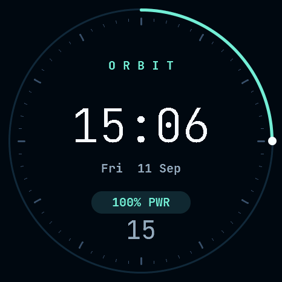 | 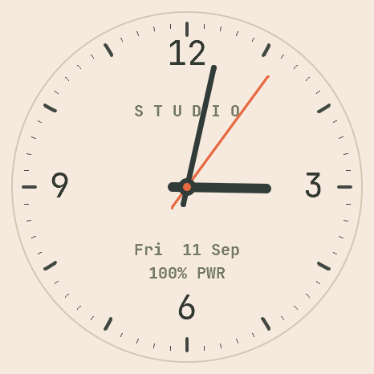 | 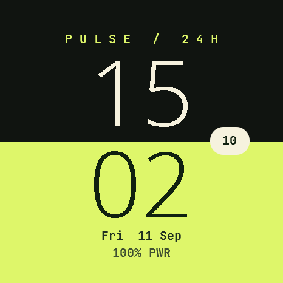 |

| Mochi | Beep | Lil' Orbit |
| --- | --- | --- |
|  | 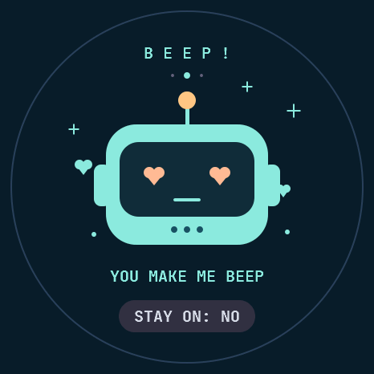 | 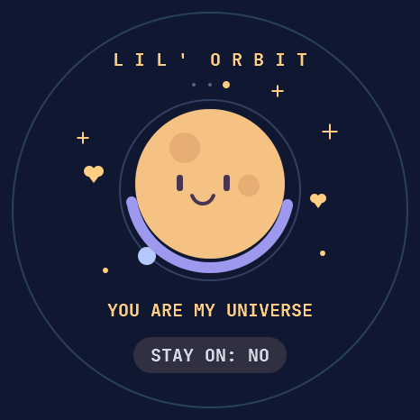 |

Swipe left/right through Digital → Analog → **Orbit** → **Studio** → **Pulse**.
The last selected watch face is remembered across restarts; Watch in the launcher
and BOOT from the launcher return to that face. Swipe vertically on a watch face
or press BOOT to open the launcher.

- **Orbit:** dark navy dial, mint seconds orbit, digital time, date and live battery.
- **Studio:** warm ivory dial, ink hands, coral seconds hand, date and live battery.
- **Pulse:** oversized stacked hours/minutes, charcoal and lime split dial, seconds,
  date and live battery. All faces use the same internal clock, in UTC+8.
- **Badge:** tap Badge in the launcher. Swipe left/right for **Mochi** the cat,
  **Beep** the robot, or **Lil' Orbit** the planet. Tap the character for a reaction.
  Characters blink/bob and the planet's moon orbits. The selected character persists.
- Tap **STAY ON** to enable/disable continuous display. It starts off on every
  app entry. PWR still switches the display off/on; BOOT or swipe down exits and
  releases the wake lock, restoring the normal screen timeout.

Artwork uses original geometric illustrations, drawn directly by LVGL at 466×466.
Each screen owns one drawing object and one refresh task; destruction removes both.
Watch faces refresh once per second; Badge requests an animation update every
100 ms while the GUI is awake. No extra full-screen bitmap is allocated. Both
physical swipes and diagnostic swipes enter the same navigation dispatcher.

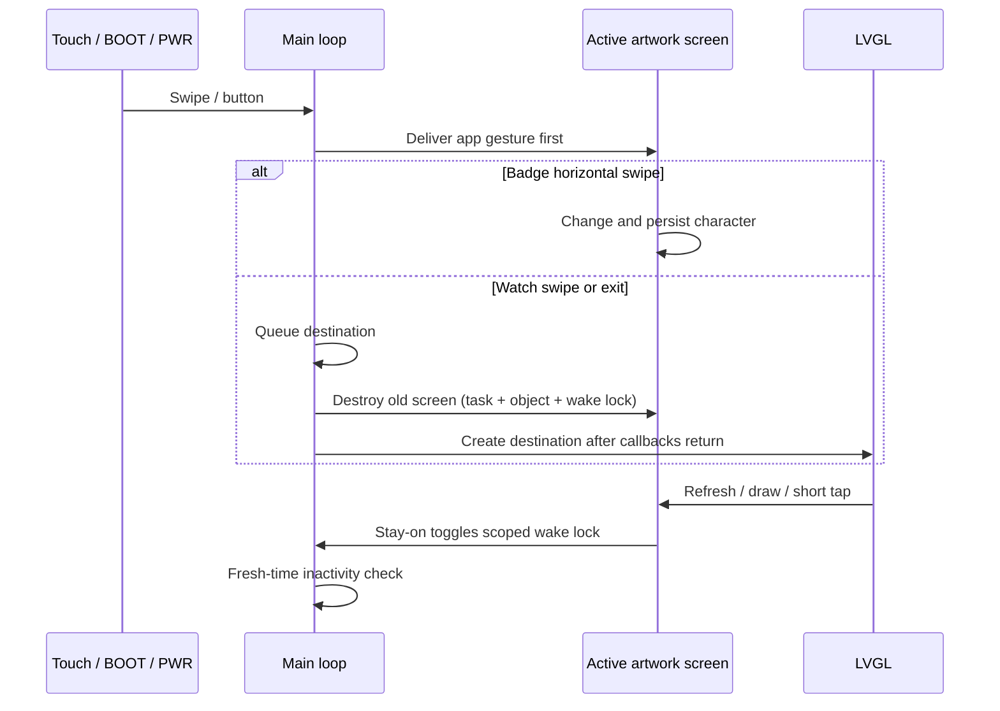

Run `python tools/validate_artwork.py --port /dev/cu.usbmodem101 --output /path/to/results`
for navigation, screenshots, raw-coordinate badge taps, sleep/wake, wake-lock
release and repeated screen destruction checks. Input injections do not prove
physical sensor behavior; captured frames do not prove optical panel appearance.

## Validation

Build and device results are recorded in `VALIDATION.md`. Successful compilation
alone does not establish that touch orientation, power behavior or rendering
works on hardware.

The current power mode turns AMOLED brightness to zero; it is **not deep sleep**.
USB, BLE, the CPU and stopwatch remain active. Wake with PWR or BOOT.
Badge Studio BLE supports time sync, device controls and photo transfer.
Gadgetbridge services, Internet time sync, activity tracking, speaker output and
OTA are not implemented. Wi-Fi photo upload remains available; microphone input
is used for Sound Buddy. See the [companion protocol](docs/COMPANION.md) and
[iOS app](../../ios/README.md).

## Five pocket applications

| Lucky Dice | Gravity | Sound Buddy |
| --- | --- | --- |
| 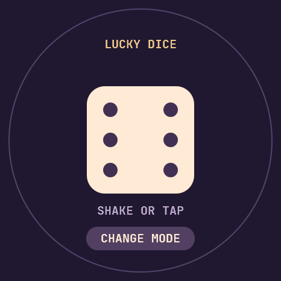 | 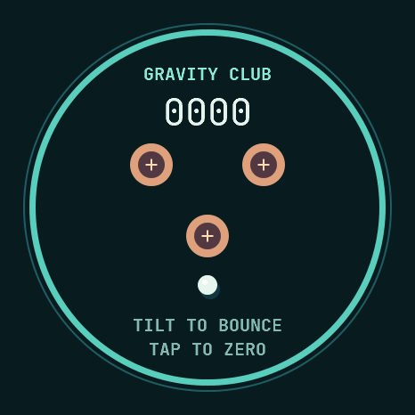 | 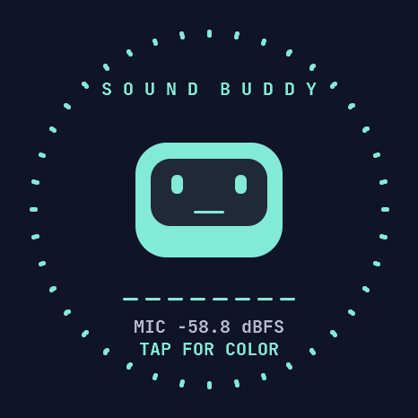 |

| Garden | Phone upload entry |
| --- | --- |
| 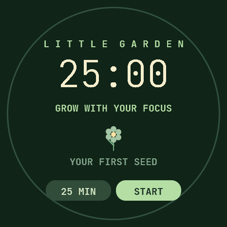 | 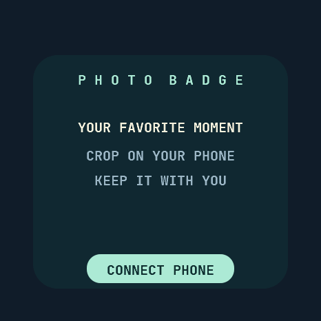 |

- **Lucky Dice:** shake or tap to roll. CHANGE MODE cycles dice, fortunes and yes/no.
- **Gravity:** tilt to roll the marble into bumpers for points. Hold the board
  level and tap to set its neutral position and reset the ball/score.
- **Sound Buddy:** the robot and eight frequency bands react to the microphone.
  Tap to change color. Audio is analyzed in RAM; it is never recorded or uploaded.
- **Garden:** choose 15, 25 or 45 minutes before starting. START/PAUSE controls
  focus; RESET cancels it. Finishing grows one persistent flower; REST starts a
  five-minute break. The timer continues on other pages and with the display off.
- **Photo Badge:** tap to show controls, then CONNECT PHONE. Scan the Wi-Fi QR
  with the phone's camera and accept joining the network. The phone's network
  assistant can automatically open the photo page. Once connected, the badge
  switches to a URL QR; scan it if the page did not open. OPEN PAGE / WI-FI CODE
  switches the codes manually. Select, drag and zoom a photo, then send it. CLOSE WI-FI returns
  to the photo. BOOT/swipe down exits. The saved image survives restart/firmware
  updates; only a complete, CRC-checked upload replaces it.

Gravity, Sound Buddy and the active upload portal keep the display awake. PWR
still turns it off/on. Leaving the application releases its wake lock and stops
its sensor/radio. Garden runs as a separate service with NVS persistence; a
valid retained clock restores a running deadline, otherwise it restores paused.
Timer completion opens Garden, deferred until leaving Photo Badge if necessary.

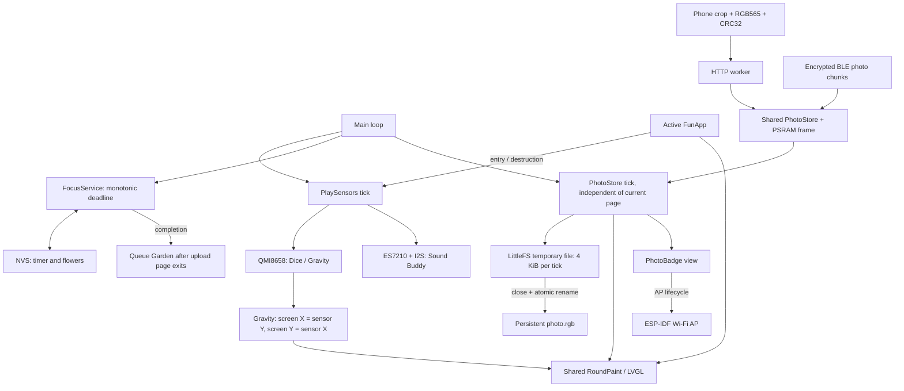

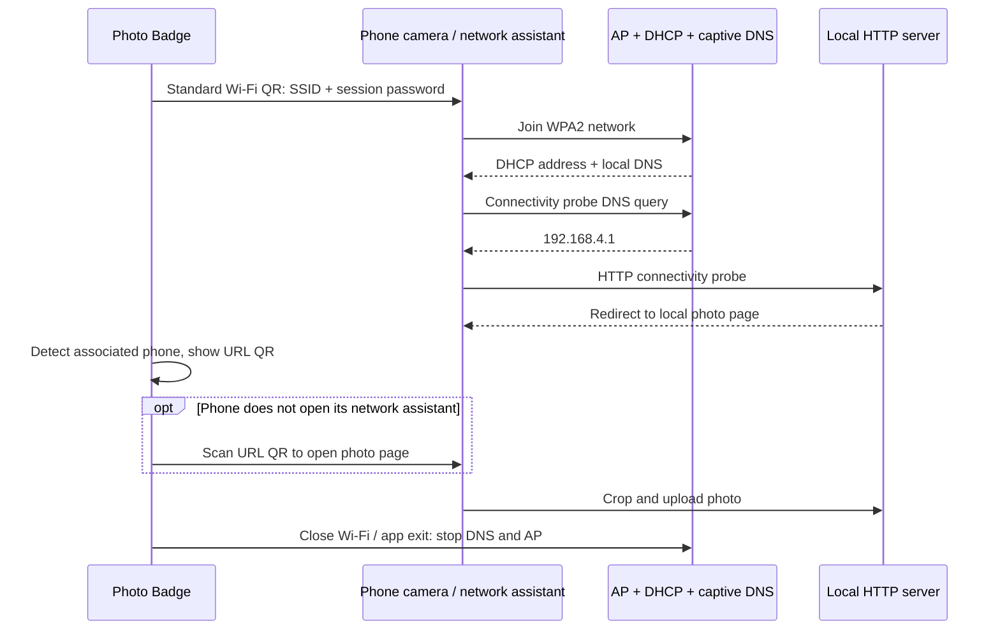

The HTTP and BLE workers share a guarded image receiver. Only the main task
accesses LittleFS and LVGL. Closing the portal cancels reception before joining the HTTP worker.
The old photo remains visible until the replacement file commits. Image-cache
entries are invalidated before their backing image is replaced or freed.

QR codes use the pinned MIT-licensed Nayuki C encoder, integer pixel scaling,
black/white modules and a four-module quiet zone. They are generated on the board
for each AP session, without an external QR service. The Wi-Fi payload is the
standard `WIFI:T:WPA;S:...;P:...;;` format; the page payload is
`http://192.168.4.1/`. A single standard Wi-Fi QR cannot also command the phone's
browser to open a URL. Automatic opening uses captive-network detection: DHCP
advertises the local DNS server, DNS answers IPv4 queries with the AP address,
and HTTP probes redirect to the photo page. Phone behavior varies; the URL QR
opens the page without typing. HTTPS connections are not intercepted.

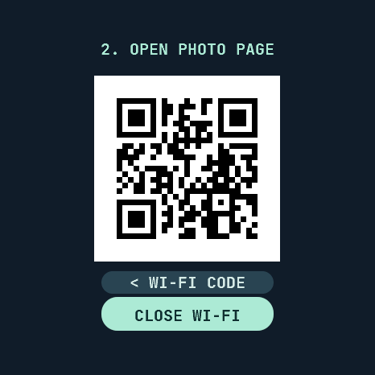

DNS runs bounded nonblocking work in the existing main loop, and its socket
closes with the AP. `PHOTO` diagnostics expose client count, displayed code type
and DNS reply count, never QR credentials or DNS query names. Do not publish
captures of a live Wi-Fi QR; it contains the session password.

Run `c++ -std=c++20 -I include tools/test_captive_dns.cpp -o /tmp/captive-dns &&
/tmp/captive-dns` to check DNS response encoding and malformed packet rejection.
Install `zxing-cpp` alongside the USB tool dependencies, then run
`python tools/validate_photo_qr.py --port /dev/cu.usbmodem101 --output /path/to/results`
to decode actual device-rendered Wi-Fi/page codes, check code switching and
session-password rotation, and repeat AP/DNS shutdown. Live Wi-Fi captures exist
only in a private temporary directory and are removed after decoding. The saved
URL QR preview contains no password or uploaded photo. `--leave-open` leaves the
last Wi-Fi code ready for a physical phone test.

ES7210 uses the manufacturer's legacy I2S path on the pinned Arduino/ESP-IDF SDK.
Its new standard I2S driver allocates callback context in PSRAM while the packaged
IRAM-safe GDMA requires internal RAM, causing initialization failure. The legacy
path works with that SDK; its deprecation warning is retained. I2S output is
explicitly unused so microphone setup cannot claim BOOT GPIO0.
The 1.75C schematic routes the microphones to ADC1/2 and SDOUT1 to GPIO10.
Mono-left captures ADC1 with 37.5 dB gain; unused channels stay disabled. The
example's high gain on ADC3/4 would amplify the auxiliary/AEC path instead.

Run `c++ -std=c++20 -I include tools/test_play_logic.cpp -o /tmp/play-logic &&
/tmp/play-logic` for timer, collision and spectrum checks. Run
`python tools/validate_play.py --port /dev/cu.usbmodem101 --output /path/to/results`
for device navigation, sensor sampling, wake locks, background timer, photo
persistence and repeated sensor/radio lifecycle checks. The device test never
uploads or captures the user's photo and skips timer interactions if one is
already in progress. It returns to the selected watch face.

## USB tools

Install `python -m pip install esptool==4.8.1 pyserial pillow` first. From this directory:

```sh
python tools/device.py --port /dev/cu.usbmodem101 inspect
python tools/device.py --port /dev/cu.usbmodem101 backup /private/path/original.bin
python tools/device.py --port /dev/cu.usbmodem101 flash
python tools/device.py --port /dev/cu.usbmodem101 sync-time
python tools/device.py --port /dev/cu.usbmodem101 send status
python tools/device.py --port /dev/cu.usbmodem101 capture /path/to/frame.png
# Restore the complete original image, checking its SHA-256 manifest first:
python tools/device.py --port /dev/cu.usbmodem101 restore /private/path/original.bin
```

Backup tools target this device's measured **32 MiB** capacity. Run `inspect`
first on any other unit. The flash command writes only bootloader at 0x0,
partition table at 0x8000 and the application at 0x10000. First boot may format
its dedicated filesystem partition. Original firmware must be backed up first.

Serial diagnostics: `page N` (0 digital, 1 analog, 2 launcher, 3 calculator,
4 stopwatch, 5 Twos, 6 settings, 7 Orbit, 8 Studio, 9 Pulse, 10 Badge,
11 Lucky Dice, 12 Gravity, 13 Sound Buddy, 14 Garden, 15 Photo Badge, 16 Pair iPhone),
`wake`, `sleep`, `status`, `capture`, and
`time YYYY-MM-DD HH:MM:SS`. `test-tap X Y` and `test-swipe left|right|up|down`
inject UI input for repeatable software tests; they do **not** test physical
CST9217 touch sensing. `status` reports the separate physical touch IRQ count.
`test-button boot|pwr` queues an event for the next matching button polling pass,
before automatic timeout evaluation. It shares the real button handler but does
not test GPIO electrical input or AXP2101 IRQ generation. `status` also reports
the configured timeout in milliseconds. Run `python tools/validate_buttons.py
--port /dev/cu.usbmodem101 --output /path/to/results` to check repeated power
toggles, BOOT wake/navigation, and automatic timeout with no serial wake helper.

The tested device reports 32 MiB flash and I2C addresses 0x18, 0x34, 0x40,
0x5A and 0x6B, matching the C board. Its display reset is GPIO1 and touch
reset GPIO2. These differ from the non-C board's GPIO39 and GPIO40.
The internal RTC keeps an integrity-checked UTC anchor across supported resets.
Full power loss invalidates it and requires USB time synchronization. This does
not provide the accuracy or independent battery backup of an external RTC.

Framebuffer capture uses 1 KiB chunks with CRC32 and acknowledgments. Duplicate
chunks are accepted after a lost acknowledgment. The ESP-IDF USB Serial/JTAG
driver owns the USB peripheral; Arduino HWCDC auto-initialization is disabled.

Run transport failure-path tests with
`python -m unittest discover -s tools -p 'test_*.py' -v`.
Run the on-device UI regression with
`python tools/validate.py --port /dev/cu.usbmodem101 --output /path/to/results`.
It drives applications and leaves the device on the digital clock.

The 1.75C touch panel is mounted opposite the display's rotation-0 coordinates.
As in the manufacturer's `05_LVGL_Widgets/13_LVGL_Widgets.ino`, SensorLib is
configured with `setMaxCoordinates(466, 466)` and `setMirrorXY(true, true)`.
Both pointer coordinates and swipe tracking consume the transformed coordinates.
`test-raw-tap X Y` uses the same SensorLib transform before injecting LVGL input;
`test-tap X Y` already takes display coordinates and does not test that transform.
