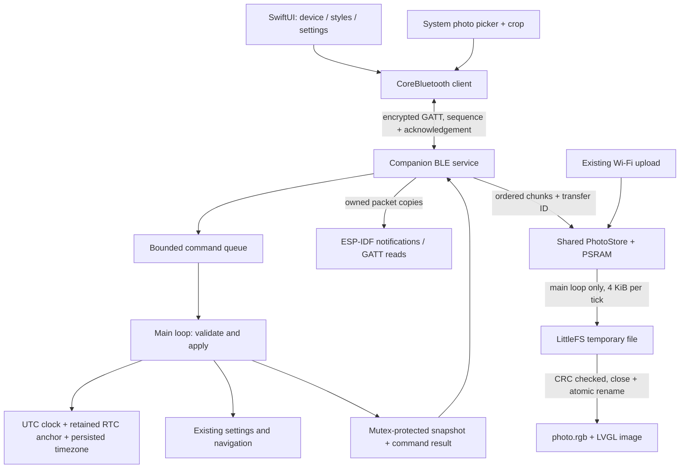
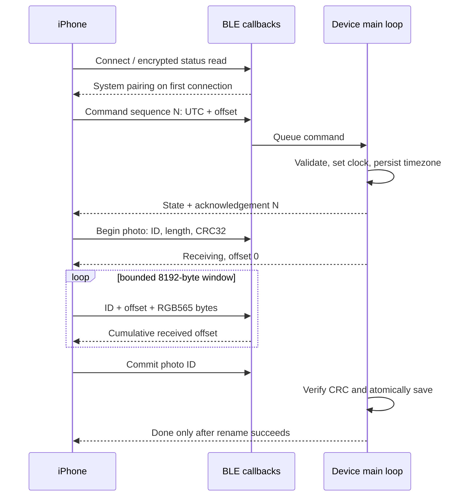

# Badge Studio / 蓝牙伴侣

The iOS app controls the existing Waveshare port over BLE, without a Wi-Fi switch.
First connection uses authenticated, encrypted BLE passkey pairing; the badge
displays the code and iOS collects it. Bonds live in NVS. The app reconnects to
its remembered peripheral while in the foreground and syncs UTC + the current
timezone offset whenever a connection becomes ready or the app becomes active.
The 1.75C has no external RTC: the ESP32 RTC anchor survives supported resets,
not total power loss. DST/travel changes are applied on the next phone sync.

## Wire protocol v1

All integers are little endian. Service `7d2ea28a-f7bd-485a-bd9d-92ad6ecfe93e`.
Characteristic UUIDs share the suffix and start with `7d2ea28b` (command),
`7d2ea28c` (state), `7d2ea28d` (photo data), `7d2ea28e` (photo state),
`7d2ea28f` (firmware version). Commands use write-with-response; photo data uses
write-without-response plus the app's flow-control window. State characteristics
support read/notify. No credentials, passkeys or image bytes are diagnostic logs.

Command (20 bytes): version u8, operation u8, sequence u16, a/b/c/d u32.
Operations: 1 time (a UTC seconds, b signed offset seconds), 2 display (a 0/1),
3 brightness (a 2/3/4), 4 timeout (a seconds: 15/30/60/120/300),
5 watch (a 0..4), 6 character (a 0..2), 7 photo begin (a length, b CRC, c ID),
8 photo commit (a ID), 9 photo cancel (a ID), 10 page (a existing page ID),
11 always-on display (a 0/1; persist before acknowledgement).
Unknown operations, invalid lengths and out-of-range values are rejected.

Device state (20 bytes): version u8, result u8 (0 OK, 1 invalid, 2 busy, 3 failed),
ack sequence u16, battery u8, brightness u8, watch u8, character u8,
timeout seconds u16, flags u8 (bit0 asleep, bit1 charging, bit2 clock valid,
bit3 always-on enabled, bit4 always-on supported),
page u8, UTC seconds u32, signed timezone offset seconds i32.

Asleep includes both a black screen and the dim ambient clock. The ambient clock
is active when bits 0 and 3 are set. Old clients ignore the added flags; new
clients expose the always-on setting only when bit4 is present. Display operation
2 with a=0 enters the configured idle mode and a=1 restores the application.

Photo data: transfer ID u32, absolute byte offset u32, payload.
Photo state (20 bytes): version u8, state u8, error u8, reserved u8,
ID u32, received bytes u32, total bytes u32, window bytes u32 (8192).
States: idle=0, receiving=1, queued=2, writing=3, done=4, failed=5.
Errors: none=0, invalid=1, busy=2, memory=3, order=4, checksum=5,
storage=6, cancelled=7, timeout=8.

A photo is exactly 466×466 RGB565 little endian (434312 bytes). Wi-Fi and BLE
share one receiver and one atomic persistence path. Competing uploads are
rejected. Disconnect cancels incomplete reception; an already committed transfer
finishes independently. Callbacks never touch LVGL, settings or LittleFS.
The app reports success only on matching command acknowledgement / photo Done.

## Thread ownership

BLE callback code owns characteristic String values. Main-loop state is copied
under a mutex for GATT reads; notifications use the ESP-IDF copying API and
atomic subscription/connection flags. The main loop never iterates the BLE
library's peer map or mutates a String while a read callback is using it. Failed
notification enqueue attempts are counted in USB diagnostics; device state is
republished and photo progress can be explicitly read by the client.

On reconnect the app seeds its next command sequence from the device's last
acknowledgement, preventing a previous session's response from completing a new
command. Photo status is also read every two seconds during a transfer, and the
watchdog advances only on actual progress or a state transition.
